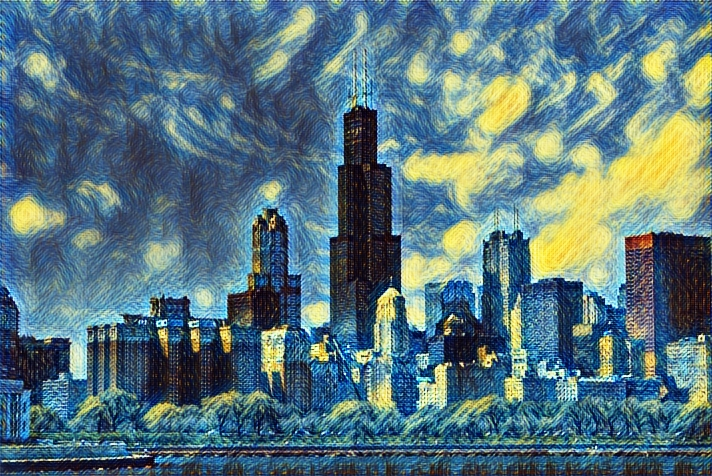
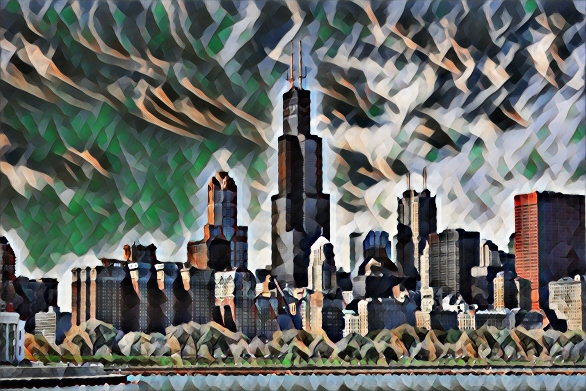
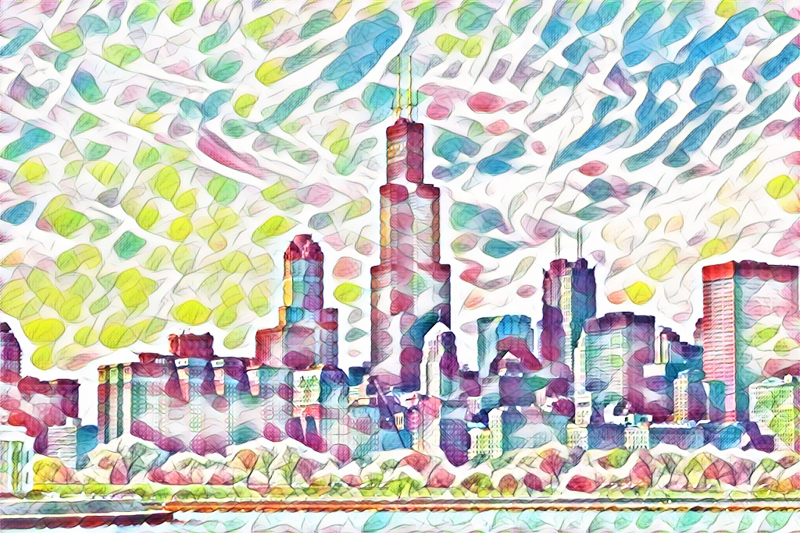
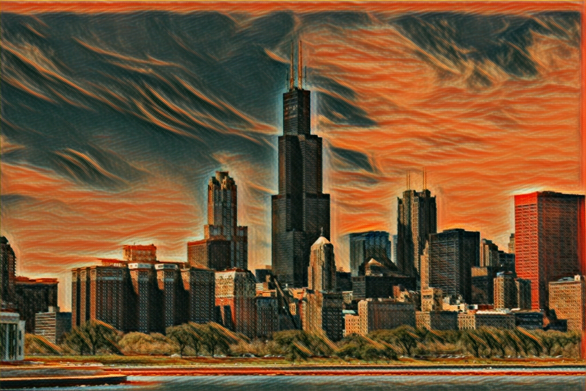
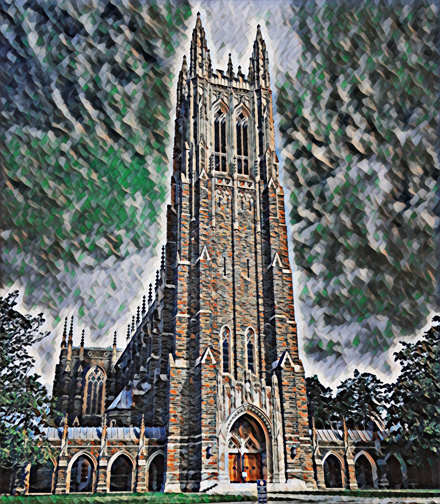

# BME590-Perceptual-Loss-Style-Transfer
By Leo Hu and Chris Zhou

This code implements style transfer from the paper **[Perceptual Losses for Real-Time Style Transfer and Super-Resolution](https://arxiv.org/abs/1603.08155)** using Tensorflow 2.0 and Keras.

In this repository we provide three notebook files to perform the following:
- Transform an image using our pre-trained models in `Transform.ipynb`
- Train a new model using your style image of choice `Train.ipynb`
- Examine possible medical applications of style transfer in ultrasound images `Ultrasound.ipynb`

### Example outputs
#### Input image

#### Styles

#### Outputs

